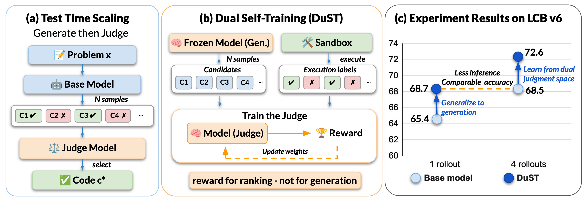

# Primal Generation, Dual Judgment: Self-Training from Test-Time Scaling

[](LICENSE)

> Anonymous code release for double-blind review. Author, affiliation, and paper
> links are withheld and will be added in the camera-ready version.

> **TL;DR**: Test-time scaling reveals which candidates succeed and which fail — but this comparative signal is discarded after inference. **DuST** (Dual Self-Training) recycles it: sample candidates, label via execution, and train the model to *rank* them by correctness using GRPO. The model is never directly rewarded for generating correct code, yet both judgment and generation improve. On LiveCodeBench, DuST boosts Best-of-4 accuracy by up to +4.1 and pass@1 by +3.1 — a single rollout from the trained model matches the base model's Best-of-4.

<p align="center">
  
</p>

## Key Idea

Most test-time scaling methods rely on external verifiers or reward models. We show that the **same model** can serve as both generator and judge:

1. **Primal (Generation)**: The model generates N=64 diverse solutions per coding problem, verified by a lightweight sandbox.
2. **Dual (Judgment)**: The model is trained via GRPO to rank candidate solutions by correctness — using only self-generated data as training signal.

This creates a virtuous cycle: better judgment → better selection at test time → better generation data → better judgment.


## Pipeline

```
 ┌──────────────────────────────────────────────────────────────────┐
 │  0. Launch Sandbox     → Docker containers for code execution    │
 │  1. Self-Distillation  → Generate N=64 solutions, verify via     │
 │                           sandbox, record pass rates              │
 │  2. Process Data       → Group into candidate sets of 4          │
 │  3. Prepare Training   → Convert to ranking prompts + labels     │
 │  4. GRPO Training      → Train judge model (Megatron + verl)     │
 │  5. Evaluation         → LiveCodeBench v5/v6 with selection      │
 └──────────────────────────────────────────────────────────────────┘
```

## Quick Start

```bash
# Install dependencies
pip install -r requirements.txt
cd third_party/verl && pip install -e . && cd ../..
cd third_party/evalchemy && pip install -e . && cd ../..

# Configure (edit this one file with your paths)
vim configs/paths.yaml

# Build sandbox & run full pipeline
docker build -t code_sandbox:latest data_generation/sandbox_image/
python data_generation/0_launch_sandbox.py --num-instances 64
python data_generation/1_generate.py --shard-rank 0 --num-shards 1
python data_generation/2_process_data.py
python training/prepare_data.py
bash training/run_grpo.sh
python eval/sweep_checkpoints.py --config eval/configs/sweep_lcbv6.yaml
```

## Setup

### Prerequisites

- Python 3.10+
- CUDA 12.x with 8x GPUs (A100/H100 recommended)
- Docker (for code sandbox)
- AWS CLI (optional, for S3 checkpoint sync)

### Third-Party Dependencies

| Component | Purpose |
|-----------|---------|
| [verl](https://github.com/volcengine/verl) | GRPO training with Megatron backend |
| [evalchemy](https://github.com/EvalAlchemy/evalchemy) | LiveCodeBench evaluation framework |

```bash
git clone https://github.com/volcengine/verl.git third_party/verl
git clone https://github.com/EvalAlchemy/evalchemy.git third_party/evalchemy
```

## Configuration

All paths are centralized in **one file** — `configs/paths.yaml`:

```yaml
model:
  hf_id: "Qwen/Qwen3-30B-A3B-Instruct-2507"
  local_cache: "/mnt/models/Qwen3-30B-A3B-Instruct-2507"
dataset:
  raw_path: "/path/to/coding_problems.parquet"
output:
  data_dir: "./output/sd_data"
  checkpoint_dir: "./output/checkpoints"
sandbox:
  docker_image: "code_sandbox:latest"
  num_instances: 64
```

Hyperparameters: `configs/data_gen.yaml` (generation) and `configs/training.yaml` (GRPO).

## Detailed Usage

### Stage 0: Launch Sandbox

We provide a minimal sandbox server in `data_generation/sandbox_image/`:

```bash
docker build -t code_sandbox:latest data_generation/sandbox_image/
python data_generation/0_launch_sandbox.py --num-instances 64
```

This starts 64 containers (ports 8080–8143) exposing:
```
POST /execute  {"code", "input", "timeout", "memory_limit_mb"}
  → {"stdout", "stderr", "exit_code", "timed_out"}
```

### Stage 1: Self-Distillation Data Generation

Generate 64 candidate solutions per problem using vLLM, verify each against test cases:

```bash
# Single GPU (debugging)
python data_generation/1_generate.py --shard-rank 0 --num-shards 1

# Multi-GPU / SLURM
python data_generation/1_generate.py --shard-rank $SLURM_ARRAY_TASK_ID --num-shards 64
```

### Stage 2–3: Data Processing

```bash
# Group solutions into candidate sets of 4, filter trivial groups
python data_generation/2_process_data.py

# Convert to verl training format (ranking prompt + pass_rate labels)
python training/prepare_data.py
```

### Stage 4: GRPO Training

```bash
# Single node (8 GPUs)
bash training/run_grpo.sh

# Multi-node
RAY_ADDRESS=auto NNODES=2 bash training/run_grpo.sh
```

### Stage 5: Evaluation

```bash
# Single checkpoint
S3_CKPT_DIR=s3://.../global_step_100 bash eval/eval_checkpoint.sh

# Sweep all checkpoints with multiple repeats
python eval/sweep_checkpoints.py --config eval/configs/sweep_lcbv6.yaml
```

## Design Choices

| Choice | Details |
|--------|---------|
| Reward function | Pairwise accuracy — fraction of correctly ordered candidate pairs |
| RL algorithm | GRPO with n=8 rollouts per prompt |
| Parallelism | Megatron EP=8 for MoE (128 experts, 3B active) |
| Context length | 32k prompt + 32k response |
| Self-distillation | Model generates its own training data (no teacher) |

## Model

- **Base**: [Qwen3-30B-A3B-Thinking-2507](https://huggingface.co/Qwen/Qwen3-30B-A3B-Thinking-2507) (Mixture-of-Experts, 30B total / 3B active)
- **Task**: Given N code candidates for a problem, output a ranking from best to worst
- **Inference**: The trained judge is used at test time to select the best among sampled solutions

## File Structure

```
configs/
├── paths.yaml              # All paths (modify this)
├── data_gen.yaml           # Generation hyperparameters
└── training.yaml           # GRPO training hyperparameters

data_generation/
├── 0_launch_sandbox.py     # Start verification containers
├── 1_generate.py           # Self-distillation pipeline
├── 2_process_data.py       # Group candidates
├── _dp_worker.py           # vLLM data-parallel worker
├── sandbox_image/          # Dockerfile + server for sandbox
│   ├── Dockerfile
│   └── server.py
├── utils/                  # Shared utilities
└── templates/              # Jinja2 prompt templates

training/
├── run_grpo.sh             # GRPO launch script
├── prepare_data.py         # Convert to verl format
└── reward_score.py         # Reward function (NDCG/PairAcc)

eval/
├── eval_checkpoint.sh      # Single checkpoint eval
├── sweep_checkpoints.py    # Multi-step sweep + aggregation
└── configs/
    ├── sweep_lcbv5.yaml    # LCB v5 preset
    └── sweep_lcbv6.yaml    # LCB v6 preset

third_party/
├── verl/                   # Training framework
└── evalchemy/              # Eval framework
```

## Citation

Withheld for double-blind review.
